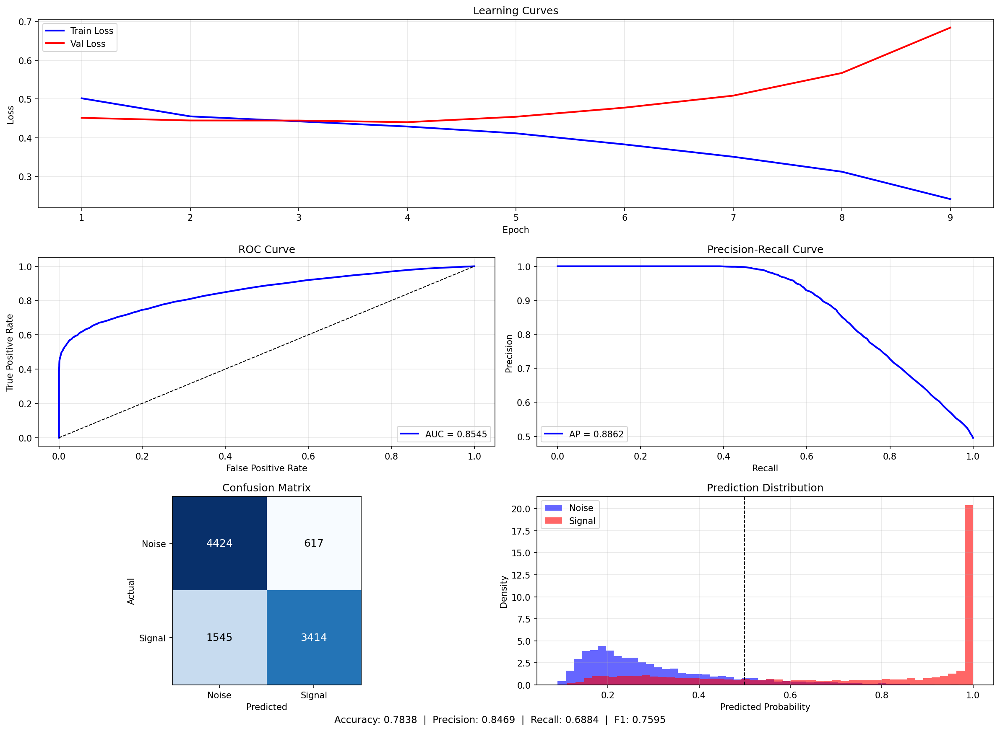

# Gravitational Wave Detection with Neural Networks

A 1D Convolutional Neural Network for binary classification of gravitational wave signals in LIGO/Virgo detector noise, built from scratch.

The main branch uses TensorFlow. A PyTorch implementation is in active development on the `pytorch` branch, motivated by the need for flexible custom loss computation in the planned physics-informed extensions.

## About This Project

I've taken some classes on Machine Learning, and done some academic projects, but I didn't *learn*. That was my goal here: I wanted to build something real, from scratch. 

But why gravitational waves? I have a Physics degree, and did my thesis on Numerical Relativity. It was a modest, though complex project: modelling the Einstein Field Equations in a spherically symmetric system. I learned quite a lot about Relativity doing it, and became somewhat obsessed with the idea of teaching a machine to understand the code that I'd built. Before actually sitting down to research and implement, my goal was then to build a Physics-Informed Neural Network to detect gravitational wave signals. It turned out that the world is a bit more complicated: coming from no experience building a neural network to building a PINN informed on General Relativity was, alas, too big a step initially. 

So I decided to phase the development. I would build a "normal" Neural Network, see how it goes, test it, and then add Physics to the mix. If you're reading this, I'm in the middle stage: this Network has no knowledge of Gravitational Wave Physics embedded into it (other than the fact that signals are correlated across detectors, and obviously the pre-processing pipeline). My plan is to start working on optimization for the next couple of weeks, and then begin adding physical constraints to the loss function. Every addition could make the model better, or worse. That's the point: I don't know.

If you're interested, I included a markdown file ([THE_SCIENCE.md](THE_SCIENCE.md)) explaining detector Physics, the pre-processing pipeline, and the full description of the Neural Network as it is right now. Additionally, if you want to jump straight to the fun, there are two Jupyter notebooks you can interact with to explore the dataset ([01_data_exploration.ipynb](notebooks/01_data_exploration.ipynb)), and to play with the model ([02_model_explorer.ipynb](notebooks/02_model_explorer.ipynb)). Future development plans are in [next-steps.md](next-steps.md). For a visual overview of the preprocessing and training pipeline, check out [PIPELINE.md](PIPELINE.md).

## Architecture

```
Input (3 detectors x 4096 samples)
    |
    |---> Detector H1 ---\
    |---> Detector L1 ----+---> Shared Conv Layers ---> GeM Pool ---> 256 features each
    |---> Detector V1 ---/
                                                            |
                                                            v
                                                  Concatenate (768 features)
                                                            |
                                                            v
                                                  Dense (256) -> Dense (64) -> Dense (1) -> Sigmoid
```

| Layer | Filters | Kernel Size | Pool Size |
|-------|---------|-------------|-----------|
| Conv1 | 32      | 64          | 4         |
| Conv2 | 64      | 32          | 4         |
| Conv3 | 128     | 16          | 4         |
| Conv4 | 256     | 8           | 4         |

## Current Performance

| Accuracy | AUC | Precision | Recall | F1 |
|----------|-----|-----------|--------|----|
| 0.784 | 0.854 | 0.847 | 0.688 | 0.759 |

<p align="center"></p>

The model overfits after ~5 epochs (visible in the learning curves), and recall lags behind precision — it's conservative, missing about 31% of real signals. Improving generalization and recall are the current priorities.

## Installation

```bash
pip install -r requirements.txt
```

Requires Python 3.8+. 

**Dependencies**: TensorFlow, NumPy, SciPy, pandas, scikit-learn, matplotlib, tqdm.

**Dataset**: [G2Net Gravitational Wave Detection](https://www.kaggle.com/c/g2net-gravitational-wave-detection) on Kaggle. For local exploration, set `G2NET_DATASET_PATH` or place the dataset in `data/g2net-gravitational-wave-detection/`.

## Usage

### 1. Compute Average PSD (one-time)

```bash
python src/data/compute_psd.py
```

Computes the average noise Power Spectral Density from noise-only samples and saves it to `avg_psd.npz`. Required before creating TFRecords or training locally.

### 2. Train on Kaggle

Training runs on Kaggle's GPU. Preprocess the dataset into TFRecords locally, upload them alongside the source code as Kaggle datasets, and push the training kernel.

```bash
# one-time: preprocess into TFRecords
python src/data/create_tfrecords.py --input <path-to-dataset> --output <path-to-output>

# upload source code and preprocessed data
kaggle datasets version -p src -m "update" --dir-mode zip
kaggle datasets version -p <tfrecords-path> -m "update"

# run training and pull results
kaggle kernels push -p kaggle
kaggle kernels output zeteixeira/gw-training -p kaggle/output
```

For local training: `python src/model_runs.py`. You need to have the full dataset on disk and access to a GPU (or not, if you don't mind having your machine running a program for days) 

## Project Structure

```
├── src/
│   ├── data/
│   │   ├── g2net.py              # Dataset loading
│   │   ├── preprocessing.py      # Signal preprocessing (whitening, filtering)
│   │   ├── compute_psd.py        # PSD computation (run once before training)
│   │   ├── create_tfrecords.py   # TFRecord generation for Kaggle
│   │   └── download_data.py      # Dataset download helper
│   ├── models/
│   │   └── diy_model.py          # 1D CNN implementation
│   ├── model_runs.py             # Training pipeline
│   └── visualization.py          # Plotting utilities
├── notebooks/
│   ├── 01_data_exploration.ipynb
│   ├── 02_model_explorer.ipynb
├── kaggle/
│   ├── train.py                  # Kaggle kernel entry point
│   └── kernel-metadata.json      # Kernel configuration
├── models/saved/                  # Trained model weights
└── requirements.txt
```

## Acknowledgments

This project uses data from the [G2Net Gravitational Wave Detection](https://www.kaggle.com/c/g2net-gravitational-wave-detection) Kaggle competition, which provides simulated gravitational wave signals injected into real LIGO/Virgo detector noise.


