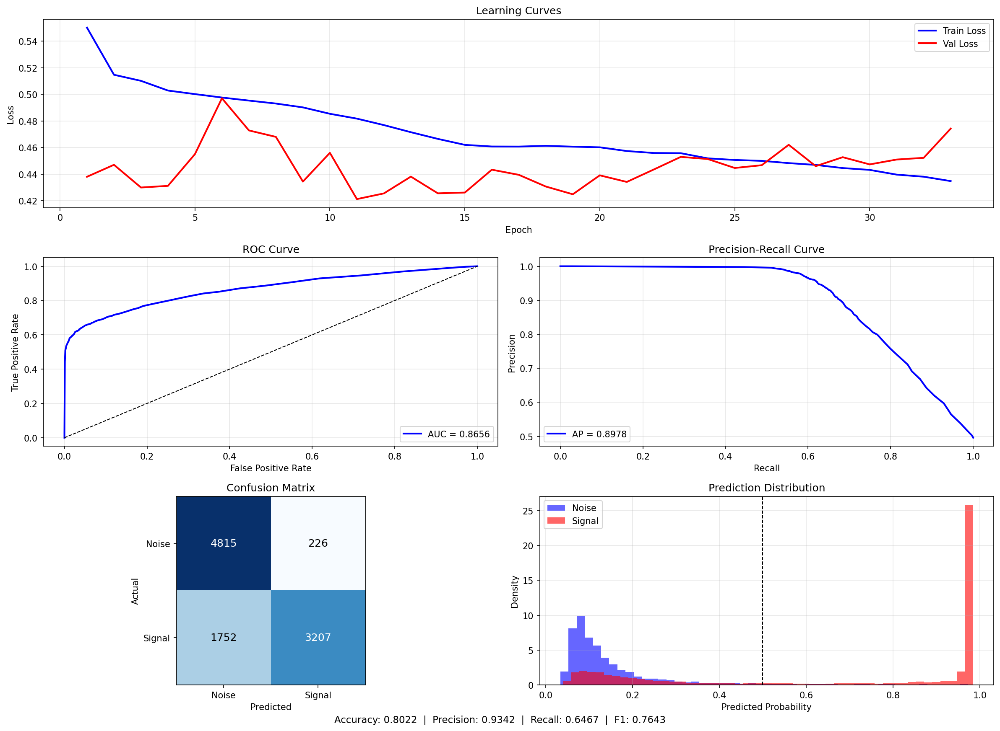

# Gravitational Wave Detection with Neural Networks

A 1D Convolutional Neural Network for binary classification of gravitational wave signals in LIGO/Virgo detector noise, built from scratch.

This branch uses PyTorch. It builds on an earlier TensorFlow implementation preserved on the `tensorflow` branch.

## About This Project

I've taken some classes on Machine Learning, and done some academic projects, but I didn't *learn*. That was my goal here: I wanted to build something real, from scratch. 

But why gravitational waves? I have a Physics degree, and did my thesis on Numerical Relativity. It was a modest, though complex project: modelling the Einstein Field Equations in a spherically symmetric system. I learned quite a lot about Relativity doing it, and became somewhat obsessed with the idea of teaching a machine to understand the code that I'd built. Before actually sitting down to research and implement, my goal was then to build a Physics-Informed Neural Network to detect gravitational wave signals. It turned out that the world is a bit more complicated: coming from no experience building a neural network to building a PINN informed on General Relativity was, alas, too big a step initially. 

So I decided to start with a binary classifier, and introduce physics into the architecture as I go. I began with a "normal" 1D CNN, which after optimization worked reasonably well ($\sim 0.85$ AUC), but failed to extract the "ambiguous" signals. It resulted in a network that was quite confident in the signals that it detected, but reverted to classifying the non-obvious signals as noise. I tried to add domain knowledge via a small GNN at the end of the CNN backbone and before the classifier head to have the network learn the correlations between signals from different detectors (gravitational waves travel at the speed of light), but it gave me no measurable improvement.

As a consequence of the stuff that I'm doing outside of this project, I started learning about Geometric Deep Learning (check out Bronstein's book on this), and found a way to properly formalize my reasoning on this. The GNN failed because a complete graph on 3 nodes has no meaningful geometry to learn from. The real geometric structure in this problem lives on the sky sphere $S^2$: a gravitational wave from a given direction arrives at each detector with specific time delays, and for a real signal all three pairwise delays must be consistent with a single point on the sky. Noise doesn't have this property. That consistency constraint is far richer than anything a 3-node graph can capture, and it's what I'm building towards now: a sky consistency map decomposed into spherical harmonics, concatenated with the CNN         features before the classifier. The CNN captures what each detector sees; the sky map captures whether they agree in a way that is geometrically consistent with an astrophysical source.  

But first, the CNN backbone itself needs work. A gravitational wave chirp has hierarchical temporal structure: it begins as a slow, low-frequency inspiral and accelerates into a rapid high-frequency merger. Resolving this requires a deep feature hierarchy where early layers capture broad oscillation patterns and deeper layers refine progressively finer temporal structure. With only 4 convolutional blocks, the network can't represent the full range of timescales present in a chirp. The next step is a deep (residual, to avoid vanishing gradients) backbone, and only then the geometric layer on top.

If you're interested, I included a markdown file ([THE_SCIENCE.md](THE_SCIENCE.md)) explaining detector Physics, the pre-processing pipeline, and the full description of the Neural Network as it is right now. Additionally, if you want to jump straight to the fun, there are two Jupyter notebooks you can interact with to explore the dataset ([01_data_exploration.ipynb](notebooks/01_data_exploration.ipynb)), and to play with the model ([02_model_explorer.ipynb](notebooks/02_model_explorer.ipynb)). Future development plans are in [developer-notes.md](developer-notes.md). For a visual overview of the preprocessing and training pipeline, check out [PIPELINE.md](PIPELINE.md).

## Architecture

```
Input (3 detectors x 4096 samples)
    |
    |---> Detector H1 ---\
    |---> Detector L1 ----+---> Shared Conv Layers ---> GeM Pool ---> 256 features each
    |---> Detector V1 ---/
                                                            |
                                                            v
                                                  Concatenate (768 features)
                                                            |
                                                            v
                                                  Dense (64) -> Dense (1) -> logits
```

| Layer | Filters | Kernel Size | Pool Size |
|-------|---------|-------------|-----------|
| Conv1 | 32      | 64          | 4         |
| Conv2 | 64      | 32          | 4         |
| Conv3 | 128     | 16          | 4         |
| Conv4 | 256     | 8           | 4         |

## Current Performance

| Accuracy | AUC | Precision | Recall | F1 |
|----------|-----|-----------|--------|----|
| 0.788 | 0.858 | 0.905 | 0.641 | 0.750 |

<p align="center"></p>

Early overfitting has been fixed by adding time shifts, Gaussian noise injection, and mixup augmentation. The model is still quite conservative, with precision outpacing recall (0.91 vs 0.64 at the default threshold). Improving recall is the current priority.

## Installation

```bash
pip install -r requirements.txt
```

Requires Python 3.8+. 

**Dependencies**: PyTorch, NumPy, SciPy, pandas, scikit-learn, matplotlib, tqdm.

**Dataset**: [G2Net Gravitational Wave Detection](https://www.kaggle.com/c/g2net-gravitational-wave-detection) on Kaggle. For local exploration, set `G2NET_DATASET_PATH` or place the dataset in `data/g2net-gravitational-wave-detection/`.

## Usage

### 1. Compute Average PSD (one-time)

```bash
python src/data/compute_psd.py
```

Computes the average noise Power Spectral Density from noise-only samples and saves it to `avg_psd.npz`. Required before creating tensor shards or training locally.

### 2. Train on Kaggle

Training runs on Kaggle's GPU. Preprocess the dataset into tensor shards locally, upload them alongside the source code as Kaggle datasets, and push the training kernel.

```bash
# one-time: preprocess into tensor shards
python src/data/create_tensors.py --input <path-to-dataset> --output <path-to-output>

# upload source code and preprocessed data
kaggle datasets version -p src -m "update" --dir-mode zip
kaggle datasets version -p <tensors-path> -m "update"

# run training and pull results
kaggle kernels push -p kaggle
kaggle kernels output zeteixeira/gw-training -p kaggle/output
```

For local training: `python src/model_runs.py`. You need to have the full dataset on disk and access to a GPU (or not, if you don't mind having your machine running a program for days) 

## Project Structure

```
├── src/
│   ├── data/
│   │   ├── g2net.py              # Dataset loading
│   │   ├── preprocessing.py      # Signal preprocessing (whitening, filtering)
│   │   ├── compute_psd.py        # PSD computation (run once before training)
│   │   ├── create_tensors.py     # Tensor shard generation for Kaggle
│   │   └── download_data.py      # Dataset download helper
│   ├── models/
│   │   └── diy_model.py          # 1D CNN implementation
│   ├── model_runs.py             # Training pipeline
│   └── visualization.py          # Plotting utilities
├── notebooks/
│   ├── 01_data_exploration.ipynb
│   ├── 02_model_explorer.ipynb
├── kaggle/
│   ├── train.py                  # Kaggle kernel entry point
│   └── kernel-metadata.json      # Kernel configuration
├── models/saved/                  # Trained model weights
└── requirements.txt
```

## Acknowledgments

This project uses data from the [G2Net Gravitational Wave Detection](https://www.kaggle.com/c/g2net-gravitational-wave-detection) Kaggle competition, which provides simulated gravitational wave signals injected into real LIGO/Virgo detector noise.


